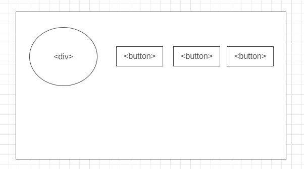

# Development Strategy

> `separation-of-concerns-project-week-2`

## Clock-and-Follow-Along-Dropdown

The collaborative reconstruction of Wes Bos JavaScript30 tutorials from Day 2(CSS + JS Clock) and Day 26(Stripe Follow Along Dropdown) by the team of enthusiastic developers.

## Wireframe

## 0. Set-Up

> repository owner: Nadia

__As a User I can see an empty site at the correct URL__

__As a fellow developer I can see the prepared repository__

### Repo

1. Generate a new repo from [javascript-30-starter](https://github.com/HackYourFutureBelgium/javascript-30-starter)
2. Create initial README file
3. Turn on GitHub Pages
4. Add collaborators
5. Create initial development-strategy
6. Prepare a project board

---
 
 ## 1. HTML&CSS structure

> assigned to Nadia

__As a site visitor, I want to see the .....__

### Repository

- developed on a branch called `_____`

### JS
- [ ] changes that has been made to the file within this user story

### HTML

- [ ] changes that has been made to the file within this user story

### CSS

- [ ] changes that has been made to the file within this user story

---

## 2. Clock-html

> assigned to Mamé

__As a site visitor, I want to see website without style so that I can see starting point of the project__

### Repository
- [x] main user story feature branch is clock-html-style-main
-[x] developed on a branch called `clock-html`

### JS
- [x] Nothing has changed

### HTML

- [x] add `div` tags give classes name each of them

### CSS

- [x] nothing has changed

---

## 3. ________

> assigned to ___________

__As a site visitor, I want to ......__

### Repository

- [ ] developed on a branch called `......`

### JS
- [ ] changes that has been made to the file within this user story

### HTML

- [ ] changes that has been made to the file within this user story

### CSS

- [ ] changes that has been made to the file within this user story

---

## 4. ________

> assigned to ___________

__As a site visitor, I want to ......__

### Repository

- [ ] developed on a branch called `......`

### JS
- [ ] changes that has been made to the file within this user story

### HTML

- [ ] changes that has been made to the file within this user story

### CSS

- [ ] changes that has been made to the file within this user story

---

## 5.  ________

> assigned to ___________

__As a site visitor, I want to ......__

### Repository

- [ ] developed on a branch called `......`

### JS
- [ ] changes that has been made to the file within this user story

### HTML

- [ ] changes that has been made to the file within this user story

### CSS

- [ ] changes that has been made to the file within this user story

---

## 6. ________

> assigned to ___________

__As a site visitor, I want to ......__

### Repository

- developed on a branch called `part 2`

### JS
- [ ] changes that has been made to the file within this user story

### HTML

- [ ] changes that has been made to the file within this user story

### CSS

- [ ] changes that has been made to the file within this user story

------
## 7. Final overall refinements (finishing touches)

> assigned to _____

__As a perfectionist, I want everything perfect :)__

### Repository

- [ ] Developed on the branch `......` <!-- if it's required -->
- [ ] Check for styling errors with a linter & prettify code
- [ ] Validate source code on w3 to check for any last mistakes
<!-- - [ ] any other points you want to add -->

### README

- [ ] changes that has been made to the file within this user story

### Development strategy

- [ ] changes that has been made to the file within this user story

### JS

- [ ] changes that has been made to the file within this user story

### HTML

- [ ] changes that has been made to the file within this user story

### CSS

- [ ] changes that has been made to the file within this user story

---
